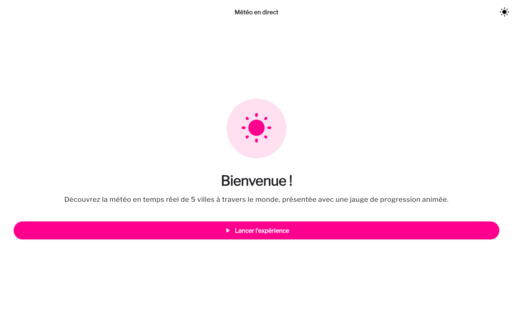
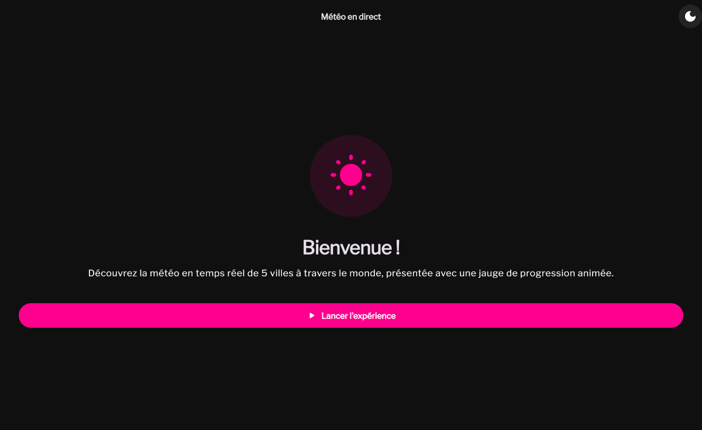
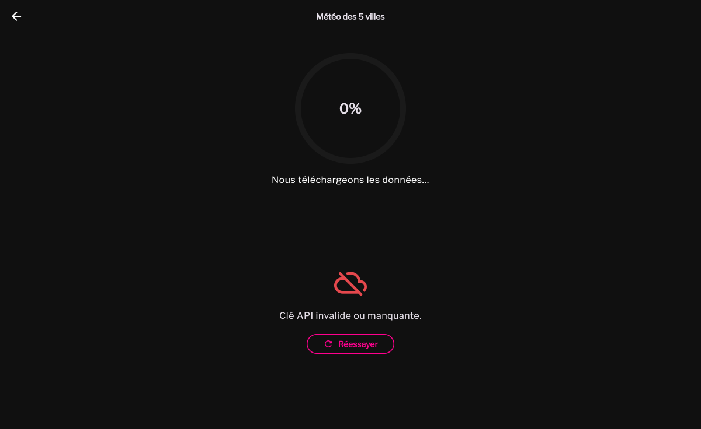

# Météo en direct

**Examen de Développement Mobile — L3 IAGE ISI 2026**

Application Flutter qui récupère la météo en temps réel de 5 villes via l'API OpenWeather,
affiche une jauge de progression animée synchronisée sur de vrais appels réseau répétés,
puis présente les résultats dans un tableau interactif — avec, pour chaque ville, une page
de détail incluant sa localisation exacte sur Google Maps.


## Aperçu

| Accueil (clair) | Accueil (sombre) | Gestion d'erreur + retry |
|---|---|---|
|  |  |  |

## Fonctionnalités

- **Écran d'accueil** — message de bienvenue et bouton pour lancer l'expérience
- **Jauge de progression animée**, synchronisée sur de vrais appels API répétés toutes
  les quelques secondes (pas un minuteur décoratif) pour les 5 villes suivies
- **Messages dynamiques** qui tournent en boucle pendant le chargement
- **Tableau interactif** des 5 villes (icône, température, description, humidité, badge pays)
- **Page de détail par ville** — infos météo complètes + localisation exacte sur Google Maps
- **Gestion des erreurs API** avec message clair et bouton « Réessayer »
- **Thème clair et sombre** soignés, palette de marque cohérente sur toute l'app
- **Bouton « Recommencer »** une fois la jauge remplie, et retour à l'accueil à tout moment

## Membres du groupe

- Zoubeir Ibrahima
- Djamal Taoufik

## Répartition du travail

| Périmètre | Responsable |
|---|---|
| Service API météo (Retrofit/Dio + OpenWeather), modèle de données `WeatherModel`, design (écrans, thème clair/sombre, tableau des 5 villes) | Zoubeir Ibrahima |
| Jauge de progression animée, messages dynamiques, navigation entre écrans, intégration Google Maps, gestion des erreurs + retry, bouton « Recommencer » | Djamal Taoufik |

## Stack technique

- Flutter 3.44 / Dart 3.12
- [`dio`](https://pub.dev/packages/dio) + [`retrofit`](https://pub.dev/packages/retrofit) pour les appels à l'API OpenWeather
- [`provider`](https://pub.dev/packages/provider) pour la gestion du thème clair/sombre
- [`google_fonts`](https://pub.dev/packages/google_fonts) pour la typographie (Libre Franklin)
- [`google_maps_flutter`](https://pub.dev/packages/google_maps_flutter) pour la localisation sur la page de détail

## Démarrage rapide

```bash
git clone https://github.com/Zoubeir23/meteo_examen_l3iage.git
cd meteo_examen_l3iage
flutter pub get
cp .env.example .env               # puis renseigner une clé OpenWeather (voir Configuration)
dart run build_runner build --delete-conflicting-outputs   # génère les .g.dart (JSON + Retrofit)
flutter run
```

## Structure du projet

```
lib/
  app.dart                        # MaterialApp, thème clair/sombre
  main.dart                       # Point d'entrée, chargement du .env
  core/
    constants/                    # Villes suivies, endpoints API
    network/                      # Client Dio, lecture de la clé API
    theme/                        # AppTheme (clair/sombre), ThemeController
    widgets/                      # Widgets partagés (ApiErrorView, CountryBadge)
  features/
    home/                         # Écran d'accueil
    main/                         # Écran principal (jauge + tableau météo)
    detail/                       # Page de détail ville + carte Google Maps
    weather/
      data/
        models/                  # WeatherModel (contrat partagé) + parsing OpenWeather
        datasources/             # WeatherApiService (Retrofit)
        repositories/            # WeatherRepository (polling, appels + gestion d'erreurs)
```

Le modèle `WeatherModel` (`lib/features/weather/data/models/weather_model.dart`)
est le contrat de données partagé entre la couche API, le tableau et la page
de détail : `cityName`, `countryCode`, `temperature`, `feelsLike`,
`description`, `iconCode`, `humidity`, `windSpeed`, `latitude`, `longitude`,
`updatedAt`.

`WeatherRepository.watchAllCitiesWeather()` interroge les 5 villes en parallèle,
plusieurs fois de suite (toutes les `ApiConstants.pollingInterval`), et émet un
résultat par cycle de sondage — c'est ce flux que la jauge de `MainScreen` suit
pour avancer en même temps que les vrais appels réseau.

## Configuration

1. Copier `.env.example` vers `.env` à la racine du projet.
2. Renseigner une clé API OpenWeather gratuite : https://openweathermap.org/api
3. Pour Google Maps (page de détail), créer **deux clés distinctes et
   restreintes** sur https://console.cloud.google.com/google/maps-apis/credentials
   (une clé unique non restreinte fonctionne aussi, mais expose inutilement
   ton quota en cas de fuite) :
   - **Android** : clé restreinte via *Application restrictions* → Android
     apps (package `sn.isi.iage.meteo_examen_l3iage` + empreinte SHA-1 de
     signature) et *API restrictions* → Maps SDK for Android. Ajouter la
     ligne `MAPS_API_KEY=ta_cle` dans `android/local.properties` (fichier non
     commité, déjà présent après `flutter pub get`) — elle est injectée
     automatiquement dans le manifest par `android/app/build.gradle.kts`.
   - **iOS** : clé restreinte via *Application restrictions* → iOS apps
     (bundle ID `sn.isi.iage.meteoExamenL3iage`) et *API restrictions* →
     Maps SDK for iOS. Copier `ios/Flutter/MapsKey.xcconfig.example` vers
     `ios/Flutter/MapsKey.xcconfig` (non commité) et y coller la clé — elle
     est lue via `Info.plist` (`GMSApiKey`) par `ios/Runner/ApiKeys.swift`.

   Sans clé, l'app se lance et compile normalement mais la carte de la page
   de détail reste grise.

## Tests

```bash
flutter analyze
flutter test
flutter test --coverage   # génère coverage/lcov.info
```

40 tests — unit tests (modèles, repository, polling), widget tests (tableau,
jauge, écrans d'accueil/détail/erreur) et un test d'intégration de bout en bout
sur `MainScreen` (chargement → tableau → détail, et cas d'erreur + retry).
≈91 % de couverture de lignes sur le code applicatif.

## Deadline

mardi 25 août 2026, 23 h 59 — aucun retard accepté.
